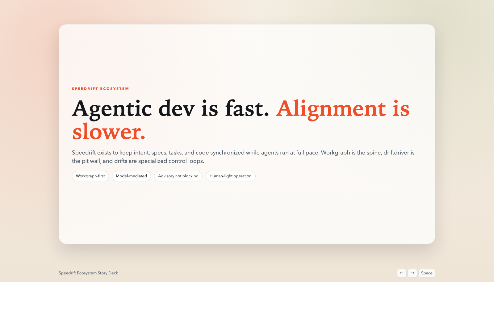
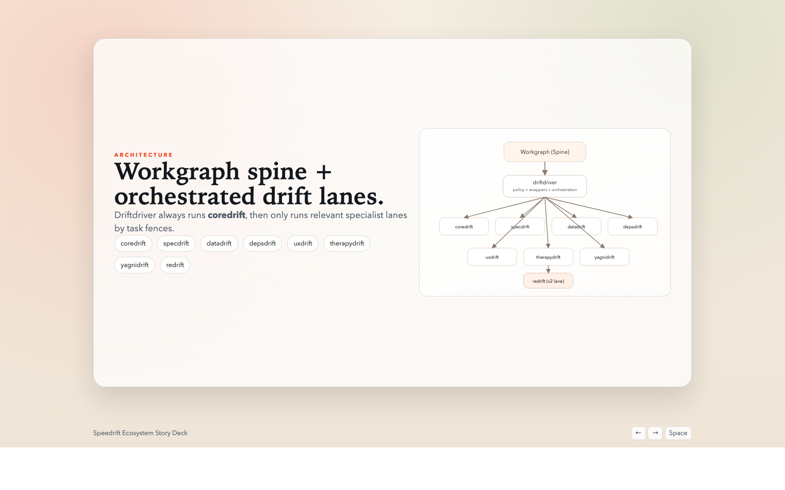
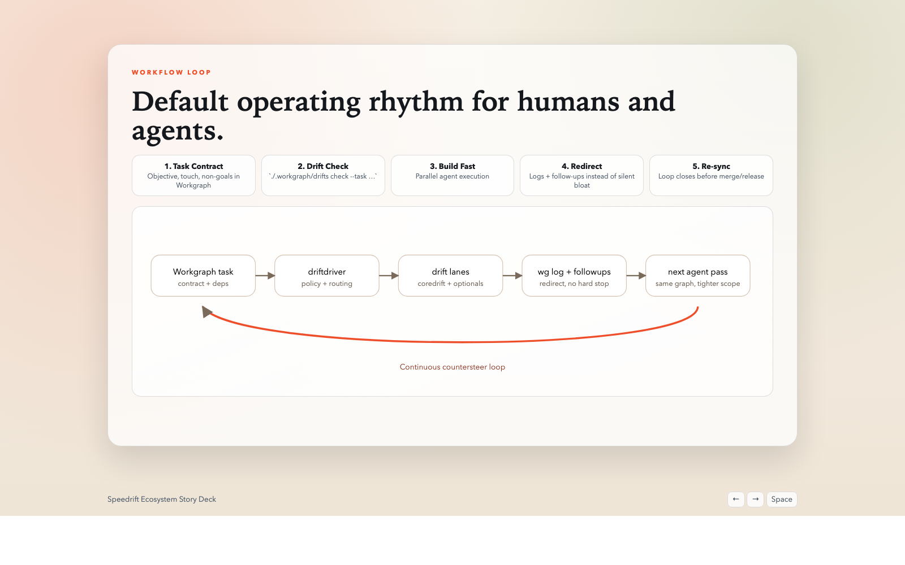
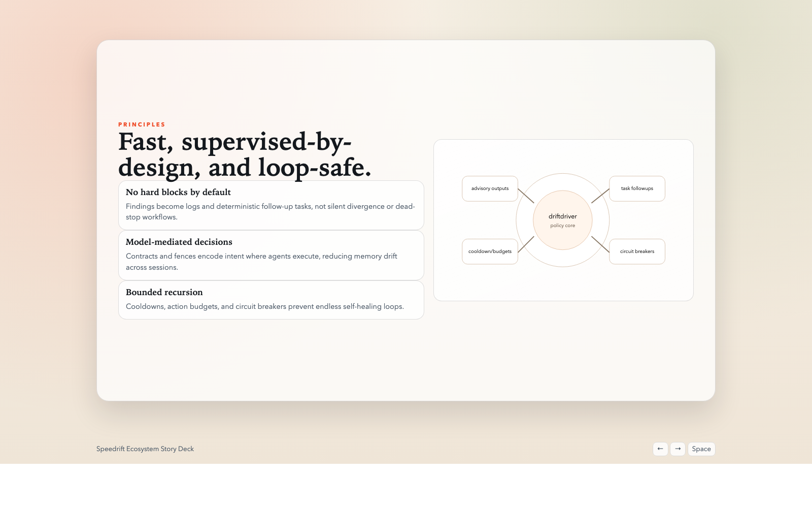

# Speedrift Ecosystem

Speedrift is a Workgraph-first control system for agentic software development.

## Status

`speedrift` is in **public beta** and under active development.

- APIs and defaults will continue evolving.
- Modules are usable now; polish and release ergonomics are still in progress.
- The near-term goal is real-world dogfooding and measurable reliability gains.

## North Star

Build software at agent speed without losing shared intent.

That means:

- plans, code, specs, and decisions stay synchronized over time
- teams can run multiple agents in parallel with bounded risk
- drift is surfaced and redirected early, not discovered at release time

## Why This Exists

Agentic coding can produce code faster than humans can supervise. The result is drift:

- code drift: fix-on-fix behavior and local workarounds
- spec drift: implementation diverges from agreed behavior
- intent drift: tasks optimize for the moment instead of the mission
- loop drift: self-healing/guardrail logic can recurse without clear limits

Speedrift is designed to keep momentum high while continuously countersteering toward alignment.

## Mental Model

Think in motorsports terms:

- **Track**: Workgraph is the shared track and lap plan (tasks, deps, loops).
- **Pit wall**: `driftdriver` is race control (policy, orchestration, wrappers).
- **Telemetry**: drift lanes produce signals and evidence.
- **Countersteer**: findings create logs and follow-up tasks instead of silent bloat.
- **Pit stop**: recovery loops (`therapydrift`, `redrift`) re-sync before failures compound.

## Usage Process

### 1) Start In 10 Minutes (Public Beta Path)

Prerequisites:

- `wg` (Workgraph CLI)
- `pipx`
- `git`

Install the currently-packaged core set:

```bash
pipx install git+https://github.com/dbmcco/driftdriver.git
pipx install git+https://github.com/dbmcco/coredrift.git
pipx install git+https://github.com/dbmcco/specdrift.git
pipx install git+https://github.com/dbmcco/datadrift.git
pipx install git+https://github.com/dbmcco/depsdrift.git
pipx install git+https://github.com/dbmcco/uxdrift.git
pipx install git+https://github.com/dbmcco/therapydrift.git
pipx install git+https://github.com/dbmcco/yagnidrift.git
pipx install git+https://github.com/dbmcco/redrift.git
```

Create a tiny working graph and run one drift check:

```bash
wg init
wg add --id start-1 "Bootstrap speedrift" --description "Create first speedrift task"
wg claim start-1
driftdriver install --wrapper-mode portable --with-uxdrift --with-therapydrift --with-yagnidrift --with-redrift
./.workgraph/coredrift ensure-contracts --apply
./.workgraph/drifts check --task start-1 --write-log --create-followups
```

Optional for Linux CI/containers:

```bash
uxdrift install-browsers
```

Expected outcome:

- wrappers exist under `./.workgraph/` (`drifts`, `coredrift`, `specdrift`, etc.)
- task `start-1` has a `wg-contract` in its description
- `wg show start-1` includes a `Coredrift:` log entry

### 2) Resume A Project

```bash
driftdriver install --wrapper-mode portable --with-uxdrift --with-therapydrift --with-yagnidrift --with-redrift
./.workgraph/coredrift ensure-contracts --apply
```

### 3) Run The Day-To-Day Loop

For each claimed task:

```bash
./.workgraph/drifts check --task <task_id> --write-log --create-followups
```

Optional continuous mode:

```bash
./.workgraph/drifts orchestrate --write-log --create-followups
```

### 4) Run Brownfield Rebuilds

Use `redrift` when rebuilding toward v2 with phased artifacts:

```bash
./.workgraph/redrift wg execute --task <root_task_id> --v2-repo <target_path> --write-log --phase-checks
```

## Ecosystem Map

Naming:

- Suite name: `speedrift` (ecosystem)
- Orchestrator CLI: `driftdriver`
- Baseline lane: `coredrift`
- Optional lanes: `specdrift`, `datadrift`, `depsdrift`, `uxdrift`, `therapydrift`, `yagnidrift`
- Rebuild lane: `redrift`

Repos:

| Repo | Role | URL |
|---|---|---|
| driftdriver | Workgraph orchestration + policy + wrappers | https://github.com/dbmcco/driftdriver |
| coredrift | baseline drift telemetry + redirect | https://github.com/dbmcco/coredrift |
| specdrift | spec/code drift | https://github.com/dbmcco/specdrift |
| datadrift | data/schema drift | https://github.com/dbmcco/datadrift |
| depsdrift | dependency drift | https://github.com/dbmcco/depsdrift |
| uxdrift | UX task/design drift | https://github.com/dbmcco/uxdrift |
| therapydrift | self-healing/loop quality lane | https://github.com/dbmcco/therapydrift |
| yagnidrift | overbuild and complexity drift | https://github.com/dbmcco/yagnidrift |
| redrift | v1->v2 re-spec/rebuild lane | https://github.com/dbmcco/redrift |

## Module Install Matrix

Most users should start with:

- `driftdriver + coredrift + specdrift + depsdrift`

Add modules by need:

- `datadrift`: schema/migration-heavy codebases
- `therapydrift`: repeated drift loops and auto-recovery control
- `yagnidrift`: complexity-control in early architecture phases
- `redrift`: brownfield rebuilds and v2 planning/execution
- `uxdrift`: browser-based UX drift checks (`uxdrift run ...`, `uxdrift wg check ...`)

## Known Limitations

Current beta limitations and workarounds are tracked in:

- `docs/known-limitations.md`

## Story Deck

Live deck:

- https://dbmcco.github.io/speedrift-ecosystem/decks/speedrift-ecosystem-story.html

Fallback:

- `docs/decks/speedrift-ecosystem-story.html`

Embedded preview:

| Slide | Preview |
|---|---|
| Why now | [](https://dbmcco.github.io/speedrift-ecosystem/decks/speedrift-ecosystem-story.html?slide=1) |
| Ecosystem architecture | [](https://dbmcco.github.io/speedrift-ecosystem/decks/speedrift-ecosystem-story.html?slide=3) |
| Workflow loop | [](https://dbmcco.github.io/speedrift-ecosystem/decks/speedrift-ecosystem-story.html?slide=4) |
| Loop-safe controls | [](https://dbmcco.github.io/speedrift-ecosystem/decks/speedrift-ecosystem-story.html?slide=7) |

## Migration Note

Legacy lane repo `dbmcco/speedrift` is retained as a deprecation pointer.
If a repo still has `./.workgraph/speedrift`, reinstall wrappers and run:

```bash
./.workgraph/coredrift ensure-contracts --apply
```

## Validation

Run ecosystem-level verification from this repo:

```bash
./scripts/verify_ecosystem.sh
```

Public-readiness smoke checks:

```bash
./scripts/public_smoke_check.sh
```

## License

MIT. See `LICENSE`.
