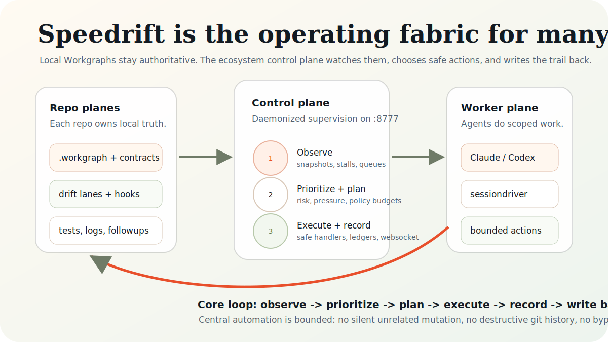

# Speedrift Ecosystem

Speedrift is an operations control plane for agent-run software work.

Each repo keeps its own Workgraph as the source of truth. Speedrift watches those repo graphs,
detects stalls and drift, plans bounded corrective actions, dispatches agents when policy allows,
and writes every decision back to tasks, logs, and ledgers.

Bounded autonomy means Speedrift can restart safe services, emit corrective tasks, and run
deterministic handlers under policy. It cannot rewrite unrelated local work without a trace, bypass
verification gates, or perform destructive git history operations.

<a href="https://dbmcco.github.io/speedrift-ecosystem/decks/speedrift-ecosystem-story.html">
  
</a>

## Start Here

If you only skim one thing, use the image above: Speedrift keeps local Workgraphs authoritative while a
central control plane observes the repo portfolio, chooses bounded safe actions, and writes decisions
back into repo tasks and ledgers.

Example: if a repo has ready work but no heartbeat, Speedrift can notice the stall, score the risk,
create or dispatch a bounded follow-up task, and record the decision without rewriting unrelated
local work.

- **One-screen explainer:** [`docs/assets/speedrift-ecosystem-summary.svg`](./docs/assets/speedrift-ecosystem-summary.svg)
- **Keynote-style story deck:** [Speedrift Ecosystem Story](https://dbmcco.github.io/speedrift-ecosystem/decks/speedrift-ecosystem-story.html)
- **Local deck file:** [`docs/decks/speedrift-ecosystem-story.html`](./docs/decks/speedrift-ecosystem-story.html)

Deck previews:

| Story | Architecture | Authority | Scorecard |
|---|---|---|---|
| [](https://dbmcco.github.io/speedrift-ecosystem/decks/speedrift-ecosystem-story.html#slide-1) | [](https://dbmcco.github.io/speedrift-ecosystem/decks/speedrift-ecosystem-story.html#slide-3) | [](https://dbmcco.github.io/speedrift-ecosystem/decks/speedrift-ecosystem-story.html#slide-4) | [](https://dbmcco.github.io/speedrift-ecosystem/decks/speedrift-ecosystem-story.html#slide-7) |

## Mental Model Shift

| Before | Now |
|---|---|
| Repo-local lane runner | Multi-repo operating fabric |
| Human polls many repos manually | Daemonized control plane supervises all tracked repos |
| Drift checks as one-off commands | Continuous cycle: observe -> prioritize -> plan -> execute -> record |
| Visibility lives in scattered logs | Live dashboard + websocket + ledgers |
| Upstream contribution is ad hoc | Structured upstream candidate pipeline |
| Generic agent prompts at dispatch | Agency-composed role configuration per task |

## Two-Layer Architecture

| Layer | Systems | Owns |
|---|---|---|
| **Execution layer** | Workgraph + Agency | *Who* runs a task: task spine, agent identity, role composition, capability primitives |
| **Judgment layer** | Planforge + Speedrift/Driftdriver | *What* to do: task contracts, drift checks, protocol wrapping, quality enforcement |

Agency composes agent configurations; planforge wraps them with speedrift protocol envelopes
(wg-contract blocks, drift check obligations, executor guidance). These two concerns are
cleanly separated — Agency never needs speedrift primitives; planforge never manages
agent composition internals.

## North Star

Build an autonomous dark-factory workflow that:

- keeps repos healthy and moving
- detects stalls, dependency issues, and aging work early
- emits corrective work into local graphs
- executes only safe bounded automation
- preserves full trail and handoff context for Claude/Codex agents

## System Layers

### Speedrift Core (repo plane)

Lives inside each repo:

- `.workgraph` task graph and dependency state
- repo-local drift lane checks
- local hooks (`session-start`, `task-claimed`, `task-completing`, `agent-error`)
- local corrective/follow-up tasks

### Speedrift Ecosystem (control plane)

Runs centrally from this repo:

- ecosystem daemon supervisor
- cross-repo snapshot + pressure scoring
- bounded factory execution loop
- central register mirror + websocket broadcast
- dashboard for narrated overview, graphs, and actionable queues

### Execution Layer (wg + Agency)

The task execution layer lives inside the worker plane:

- **Workgraph** (`wg`) is the task spine — dependency graph, dispatch, loops, readiness tracking.
- **Agency** (`agency serve`) is the agent composition engine — it owns *who* runs a task:
  role identity, capability primitives, trade-off tuning.

At dispatch time Agency composes the agent configuration for a task. Planforge/speedrift
wrap the result with the speedrift protocol envelope (wg-contract block, executor guidance,
drift check obligations). The two concerns stay separated: Agency never needs speedrift
primitives; planforge never manages agent composition internals.

Agency runs as an always-on launchd service on port `8000`. If unreachable, all dispatch
continues with generic prompts — Agency enriches but is never required.

### Worker Plane

Execution engines used in repos:

- Claude Code CLI
- Codex
- `claude-session-driver` workers

Workers consume ready tasks, run checks, and write outcomes back to local graph state.

## Authority Contract

### Central can

- restart stopped repo services when work is queued
- run deterministic safe handlers (`factorydrift`, `sessiondriver`, `secdrift`, `qadrift`, `plandrift`)
- emit corrective tasks into local repo graphs
- publish status to dashboard/api/websocket
- write cycle decision ledgers

### Central cannot (without explicit policy + local trace)

- perform destructive git history operations
- mutate unrelated local work silently
- bypass required verification gates
- hide decisions outside ledgers and graph artifacts

## End-to-End Automation Flow

1. You work in any repo with Claude/Codex.
2. Repo-level workgraph and drift tooling update local state.
3. Local status is mirrored into the central register.
4. Ecosystem daemon runs a cycle:
   - observe all repos
   - prioritize pressure/risk
   - plan bounded actions
   - execute safe handlers (if `plan_only=false`)
   - record ledger + websocket update
5. Corrective or review tasks are written back into the local repo graph.
6. Local agents continue with full trail of what central automation did and why.

## Mode Contract

- `plan_only=true`:
  - plan, narrate, score, and emit follow-up tasks
  - no automatic handler execution
- `plan_only=false`:
  - execute deterministic safe handlers within policy budgets

Dashboard should always show active mode.

## Control Repo Runtime State

This repository is the ecosystem control repo, not a normal product/app repo.

- `.workgraph/service/**` holds local runtime state for the hub, central register mirror, snapshots, and ledgers
- that state is intentionally local and should not be committed
- public source of truth for this repo is the checked-in docs, scripts, and [`ecosystem.toml`](./ecosystem.toml)
- if you need live status, use the dashboard/API/websocket rather than git state under `.workgraph/`

## Dashboard Contract

The operator view should be ordered as:

1. Narrated overview
2. Operational overview
3. By-repo status cards
4. Graph view (repo + inter-repo dependencies)
5. Attention queues (aging gaps, dependency breaks, risk queues, upstream candidates)

Interaction rules:

- click a repo card to focus repo graph
- keep a global inter-repo graph view available
- show active repos/tasks visually (for example pulsing indicators)
- every queue item should include a ready-to-run Claude/Codex prompt, not shell-only commands

## Repo Health + Stall Semantics

Repo cards should include a short reason line for `watch` or `at-risk`, such as:

- service stopped while ready tasks exist
- dependency chain blocked on upstream repo
- aging in-progress tasks without heartbeat
- repeated failed verification loopbacks

This makes non-active repos explainable instead of silent.

## Inter-Repo Dependency Model

Track and visualize:

- repo-to-repo edges (producer/consumer, contract dependencies, blocked-by links)
- active path highlighting across repo boundaries
- dependency bottlenecks and missing edge metadata

Graph direction consistency is layout-dependent; semantics come from edge metadata, not visual orientation.

## Repo Discovery Contract

The ecosystem hub builds its repo set from two sources:

- canonical suite entries from [`ecosystem.toml`](./ecosystem.toml)
- autodiscovered workspace repos that have a local WorkGraph plus Speedrift policy markers

The hub should surface the full matching set within the activity horizon, not an arbitrary truncated sample.

## Modules (Model-Mediated)

Core lane family:

- `coredrift`, `specdrift`, `datadrift`, `archdrift`, `depsdrift`
- `uxdrift`, `therapydrift`, `yagnidrift`, `redrift`

Ecosystem control modules:

- `factorydrift`: cycle planning + bounded execution
- `sessiondriver`: ready-task dispatch with `claude-session-driver`
- `secdrift`: security pressure + remediation task emission
- `qadrift`: quality/UX/test pressure + remediation task emission
- `plandrift`: test gates, failure loopbacks, continuation-edge integrity (`double-shot-latte`)
- `northstardrift`: effectiveness scoring, regression detection, narrated awareness, and bounded follow-up emission against the dark-factory north star

## Upstream Contribution Loop

Imported external repos are not just pull targets.
The ecosystem should continuously produce upstream candidate packets:

1. detect reusable local improvements
2. bundle context, rationale, and changed files
3. emit draft-PR candidate tasks
4. track opened/merged outcomes in the register

## Ecosystem Impact Model (Mechanics Only)

Show formulas and illustrative values, not production data:

- coverage:
  - `% repos reporting = reporting / registry`
- flow health:
  - `stall_rate = stalled / reporting`
  - `dependency_gap_rate = repos_with_dep_gaps / reporting`
  - `aging_pressure = weighted stale open + stale in-progress`
- execution reliability:
  - `factory_cycle_success = succeeded_actions / attempted_actions`
  - `session_dispatch_success = successful_dispatches / attempted_dispatches`
- quality + security:
  - `security_pressure = critical*5 + high*3 + medium*1`
  - `quality_pressure = high*3 + medium*1`
  - `plan_integrity_coverage = repos_meeting_test_loopback_controls / repos_with_active_work`
- upstream leverage:
  - `candidate_throughput = candidate_packets / period`
  - `accepted_upstream_ratio = merged_upstream_prs / opened_upstream_prs`

Always pair each metric with:

- trend (`improving`, `flat`, `worsening`)
- tier (`healthy`, `watch`, `at-risk`)
- next intervention prompt

`northstardrift` is the module that should compute these scorecards, detect regressions, and emit model-mediated follow-up prompts/tasks from them.
Design contract: [docs/northstardrift.md](./docs/northstardrift.md)

## Daemon + Endpoints

Run the ecosystem daemon continuously and codify the port.

From `driftdriver` repo:

```bash
ECOSYSTEM_HUB_CENTRAL_REPO=/Users/braydon/projects/experiments/speedrift-ecosystem/.workgraph/service/ecosystem-central \
  scripts/ecosystem_hub_daemon.sh ensure-running
```

Default endpoint contract:

- dashboard: `http://127.0.0.1:8777/`
- api: `http://127.0.0.1:8777/api/status`
- websocket: `ws://127.0.0.1:8777/ws/status`
- tailscale access: `http://<tailscale-host-or-ip>:8777/`

## Quick Start

### 1) Install core CLIs

```bash
pipx install git+https://github.com/dbmcco/driftdriver.git
pipx install git+https://github.com/dbmcco/coredrift.git
pipx install git+https://github.com/dbmcco/specdrift.git
pipx install git+https://github.com/dbmcco/datadrift.git
pipx install git+https://github.com/dbmcco/depsdrift.git
pipx install git+https://github.com/dbmcco/uxdrift.git
pipx install git+https://github.com/dbmcco/therapydrift.git
pipx install git+https://github.com/dbmcco/yagnidrift.git
pipx install git+https://github.com/dbmcco/redrift.git
```

### 1b) Install Agency (execution layer)

Agency is the agent composition engine that pairs with workgraph. Install once per machine.

```bash
# Install
pipx install git+https://github.com/agentbureau/agency.git --python python3.14

# Initialize primitive pool and configuration
agency init

# Load the launchd service (always-on, port 8000)
launchctl load ~/Library/LaunchAgents/com.braydon.agency-serve.plist

# Verify
curl -s http://localhost:8000/health | python3 -m json.tool
```

The launchd plist is in `driftdriver/plists/com.braydon.agency-serve.plist`. Agency uses
Ollama `qwen3-embedding:8b` for embeddings — no separate embedding service needed.

### 2) Enable a repo

```bash
wg init
driftdriver install --all-clis --wrapper-mode portable
./.workgraph/coredrift ensure-contracts --apply
```

### 3) Configure execute-mode policy

In `.workgraph/drift-policy.toml`:

```toml
[factory]
enabled = true
plan_only = false
emit_followups = true
hard_stop_on_failed_verification = true

[sessiondriver]
enabled = true
require_session_driver = true
allow_cli_fallback = false
max_dispatch_per_repo = 2
worker_timeout_seconds = 1800
drift_failure_threshold = 3

[secdrift]
enabled = true
emit_review_tasks = true

[qadrift]
enabled = true
emit_review_tasks = true

[plandrift]
enabled = true
emit_review_tasks = true
require_integration_tests = true
require_e2e_tests = true
require_failure_loopbacks = true
require_continuation_edges = true
continuation_runtime = "double-shot-latte"
orchestration_runtime = "claude-session-driver"
allow_tmux_fallback = true

[northstardrift]
enabled = true
emit_review_tasks = true
emit_operator_prompts = true
daily_rollup = true
weekly_trends = true
score_window = "1d"
comparison_window = "7d"
dirty_repo_blocks_auto_mutation = true
```

### 4) Keep control plane running

Use daemon `ensure-running` for always-on supervision.

## Validation

From this repo:

```bash
./scripts/verify_ecosystem.sh
./scripts/public_smoke_check.sh
```

## Repo Map

Canonical suite map: [`ecosystem.toml`](./ecosystem.toml)

Primary repos:

- `driftdriver`
- `coredrift`
- `specdrift`, `datadrift`, `archdrift`, `depsdrift`
- `uxdrift`, `therapydrift`, `yagnidrift`, `redrift`

## Additional Docs

- [Deck index](./docs/decks/README.md)
- [Northstardrift design](./docs/northstardrift.md)
- [Known limitations](./docs/known-limitations.md)

## Credits and Upstream Dependencies

Speedrift builds on and is deeply grateful to the following upstream projects:

### [Workgraph](https://github.com/graphwork/workgraph) — graphwork
The task graph spine that everything runs on. Workgraph provides dependency tracking,
agent dispatch loops, coordinator messaging, and the worker service model. Speedrift
wraps and extends Workgraph but does not replace it — `wg` is the runtime source of
truth for all task state. We maintain a fork at [dbmcco/workgraph](https://github.com/dbmcco/workgraph)
and track upstream continuously via `upstream_tracker.py`.

### [Agency](https://github.com/agentbureau/agency) — agentbureau
The agent composition engine that forms the other half of the execution layer. Agency
owns agent identity, role composition, capability primitive matching, and trade-off tuning.
It runs as an always-on service that Speedrift integrates with at dispatch time — Agency
composes *who* runs a task; Speedrift/planforge determines *what* to do and wraps the
result with the protocol envelope. We install Agency via pipx and patch `embedding.py`
to use the ecosystem's shared Ollama embedding service instead of bundled HuggingFace
models.

### [Freshell](https://github.com/danshapiro/freshell) — Dan Shapiro
A browser-based terminal that gives agents and operators a persistent PTY session
accessible over the web. Used in the ecosystem hub for live terminal access to any
enrolled repo. We run it at port 3550 and track upstream for upgrades. Maintained as
a fork at [dbmcco/freshell](https://github.com/dbmcco/freshell).

---

If you build something useful on top of these projects, contribute upstream.
